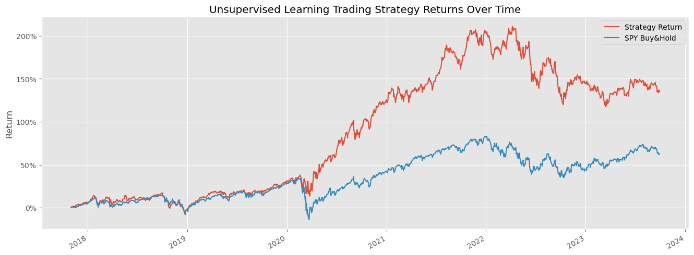

 
Table of Contents

  <ol>
    <li>
      <a href="#about-the-project">About The Project</a>
      <ul>
        <li><a href="#built-with">Built With</a></li>
      </ul>
    </li>
    <li>
      <a href="#getting-started">Getting Started</a>
      <ul>
        <li><a href="#parameters-used-to-optimize-model">Parameters</a></li>
        <li><a href="#installation">Installation</a></li>
      </ul>
    </li>
    <li><a href="#usage">Usage</a></li>
    <li><a href="#roadmap">Roadmap</a></li>
    <li><a href="#contributing">Contributing</a></li>
    <li><a href="#license">License</a></li>
    <li><a href="#contact">Contact</a></li>
    <li><a href="#acknowledgments">Acknowledgments</a></li>
  </ol>

About the project

<!-- PARAMETERS -->
## Parameters Used to Optimize Model

### GARCH (Generalized Autoregressive Conditional Heteroskedasticity)

GARCH is a statistical model used to analyze and forecast time series data with changing volatility. It is particularly useful in financial markets where volatility clustering is observed, meaning periods of high volatility tend to cluster together.

#### Interpreting GARCH

- **Volatility Persistence**: GARCH models capture the tendency of volatility to persist over time. High volatility periods are likely to be followed by more high volatility, and vice versa.

- **Impact of Shocks**: GARCH models distinguish between the short-term impact of shocks (captured by \( \varepsilon_{t-i}^2 \)) and the long-term impact (captured by \( \sigma_{t-j}^2 \)) on volatility.

- **Forecasting Volatility**: GARCH models can be used to forecast future volatility based on past data. This is particularly useful for risk management and derivative pricing in financial markets.

### RSI (Relative Strength Index) 

RSI is a popular momentum oscillator used in technical analysis to measure the speed and change of price movements. It oscillates between 0 and 100 and is typically used to identify overbought or oversold conditions in a market.

#### Interpreting RSI

- **Overbought Conditions (RSI > 70)**: When RSI crosses above the 70 level, it suggests that the asset may be overbought, meaning the price may have risen too far, too fast. Traders might consider selling or taking profits.
  
- **Oversold Conditions (RSI < 30)**: Conversely, when RSI drops below 30, it indicates that the asset may be oversold, suggesting that the price may have fallen too far, too fast. Traders might consider buying or entering long positions.

### Bollinger Bands

Bollinger Bands are a technical analysis tool introduced by John Bollinger. They consist of three lines plotted on a price chart: a simple moving average (SMA) in the middle, and an upper band and a lower band that are typically two standard deviations away from the SMA.

#### Calculation of Bollinger Bands

1. **Middle Band (SMA)**: The middle band is typically a 20-period simple moving average (SMA) of the price.
  
2. **Upper Band**: The upper band is calculated by adding two standard deviations to the SMA.
  
3. **Lower Band**: The lower band is calculated by subtracting two standard deviations from the SMA.

#### Interpreting Bollinger Bands

- **Volatility Measurement**: Bollinger Bands expand and contract based on the volatility of the price. Narrow bands indicate low volatility, while wide bands indicate high volatility.

- **Overbought and Oversold Conditions**: Prices that touch or exceed the upper band may be considered overbought, suggesting a potential reversal or correction. Conversely, prices that touch or fall below the lower band may be considered oversold, suggesting a potential buying opportunity.

- **Squeeze Patterns**: When the bands contract towards each other, it indicates decreasing volatility, often preceding a significant price movement. Traders may anticipate a breakout when a squeeze pattern occurs.

### Moving Average Convergence Divergence (MACD)
 When the MACD line crosses above the signal line, it's considered a bullish signal, suggesting that the momentum is shifting upwards and it may be a good time to buy. Conversely, when the MACD line crosses below the signal line, it's seen as a bearish signal, indicating a potential downtrend and a signal to sell.

### Average True Range (ATR)

 ATR is a technical indicator used by traders to measure market volatility. It provides insights into how much an asset's price typically moves over a given period.
 
 Higher ATR values indicate greater price volatility, while lower values suggest less volatility. Traders use ATR to gauge the volatility of an asset. Higher ATR values may indicate potential trading opportunities for strategies that capitalize on volatility, such as trend-following or breakout trading.

(<a href="#readme-top">back to top</a>)

usage

